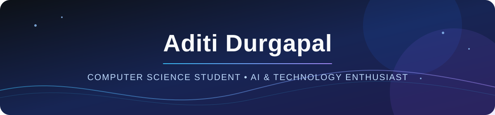

 

## About Me

- Final-year **B.Tech Computer Science** student at Mody University of Science and Technology, with a **CGPA of 8.04/10**
- Built a foundation in **Java, Python, SQL, Data Structures & Algorithms, Object-Oriented Programming, DBMS, and Computer Networks**
- Interested in **artificial intelligence, machine learning, backend systems, and practical web applications**
- Technical Team Coordinator at **Enginium**, where I coordinated the technical team and published **two technical articles** in the university's annual magazine
- Event Anchor for the Mody University Alumni Meet and Farewell Ceremony, engaging large audiences and managing stage proceedings
- Certified in **AI in Cybersecurity**, **Internet of Things**, **Python Programming**, and **C Programming**

---

## 🛠️ Tech Stack & Tools

**Languages**

**Web & Frontend**

**Backend & Data**

**AI & Tools**

---

## 🤝 Connect With Me

